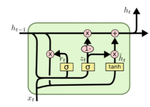
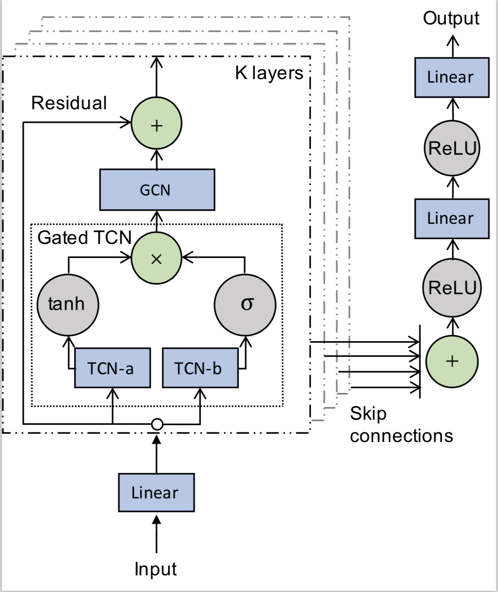

# QRFT-Toy-Project
Python files for project

## Requirements
- python 3.7
- pypfopt
- torch
- numpy
- pandas
- argparse
- sklearn
- datetime
- tdqm

# Train the models  


First train the model with 70% of dataset then performs one-step ahead cross validation for test datset.  
In this case, there are 106 folds generated for validation. 

Data are preprocessed and saved in './data/features' directory. 

'train_MODELNAME.py' deals with generating dataloader and one-step ahead cross validation with given model.

## Train LSTM model
  

```
python train_LSTM.py --in_past_seq 120 
python train_LSTM.py --in_past_seq 253 
```


## Train Graph Wavenet model 


```
python train_GW.py --in_past_seq 120 
python train_GW.py --in_past_seq 253 
```
